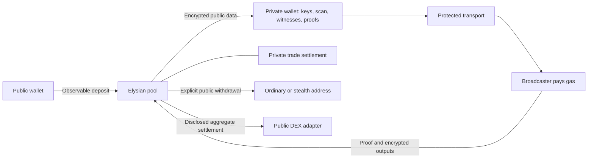

**Elysian: implementation plan for stronger user privacy**

Written 22 September 2026. This is the implementation roadmap requested after the [privacy audit](PRIVACY-AUDIT-2026-09-22.md). The work below is proposed, not implemented or independently approved. The objective is Elysian's own defensible privacy guarantees, rather than equivalence to another project.

**The product we should build**

Keep the main user actions simple: **Shield, Send, Trade**. Underneath them, operate a shared shielded wallet and settlement system with local keys, local proving, private asset balances, protected submission, and recoverable funds. Users should not need a public wallet connected for ordinary shielded activity.

The strongest payment stays inside the shielded system. A payment to an ordinary public address leaves it. A standard ERC-20 transfer publishes its source, destination and amount; a native ETH payment also has publicly observable value flow. A smart contract or relayer cannot erase that information. The target for a public withdrawal is concealment of which shielded notes funded it, with explicit residual amount/timing risks. It is not an invisible credit to an existing public account. This follows from the [ERC-20 transfer interface and event](https://eips.ethereum.org/EIPS/eip-20) and the [public EVM privacy model](https://ethereum.org/privacy/ethereum).

Likewise, the deposit that introduces publicly held funds is observable. Shielding should protect subsequent activity; it cannot remove the deposit's history. An observer who controls every other participant, observes both endpoints, or compromises the user's device can defeat some protections. We must state and test the adversaries covered by each promise.

| User action | Target behavior | What remains observable |
| --- | --- | --- |
| Shield ETH, USDG or a compatible ERC-20 | Create recoverable private notes with no published shielded owner or persistent account identifier. | Public funding address, asset, amount, time and pool interaction. ETH wrapping can be visible too. |
| Send to an Elysian shielded recipient | Conceal note owner, recipient, amount, asset and input/output linkage from outside observers; keys and witnesses stay local. | Existence/timing of a shielded action and a standardized public transaction shape. Parties know the payment they participate in. Inference can remain in sparse activity. |
| Send to a compatible stealth recipient | Deliver to a fresh address derived for that recipient, with protected submission and a recovery/spending path. | Fresh destination, token and amount remain public. The recipient's usual address is not included in the payment, subject to subsequent behavior and implementation assumptions. |
| Send to an arbitrary existing `0x` address | Relay an explicit withdrawal; do not reveal the sender's public wallet as the outer signer or directly reveal the input notes. | Destination, asset, amount, timing and pool origin. Statistical source linkage cannot be ruled out. |
| Trade within private liquidity | Exchange shielded ownership without an individual public ERC-20 movement, public order size/pair, or wallet signer. | Protocol activity and any intentionally public aggregate state; trading counterparties know their own side. Confidentiality from an operator depends on the chosen execution protocol. |
| Trade through a public DEX | Aggregate external settlement where feasible and return value to shielded notes. | Public DEX route, aggregate pair/amounts, time and contracts. A one-order aggregate reveals that order's economics. |

An ordinary wallet address alone does not provide the encryption/viewing keys needed for shielded delivery or the meta-address needed for standard stealth delivery. “Any wallet privately with no linkages” must therefore become two explicit capabilities: private delivery to a compatible recipient, and source-protected withdrawal to an ordinary address. Do not pretend the latter hides the destination payment.

**Recommended architecture**

The private wallet generates and stores secrets, downloads generic authenticated chain data, scans locally, builds witnesses locally, and produces proofs locally. A protected transport carries a standardized submission to a broadcaster. The broadcaster pays gas and submits proof-authorized actions to a shared pool. Notes, private order commitments and settlement records use authenticated global roots. Private trading settles note ownership inside the pool; public DEX access is a separately disclosed route.

This is a target data flow, not proof that every arrow is currently private. In particular, a normal HTTPS connection does not conceal the client from its destination server, and an encrypted order is not confidential from a service that holds its decryption key.

**Step 1 — Preserve existing funds and establish a versioned baseline. Do this first.**

Record the current deployed contracts, compiler settings, circuit sources, R1CS, proving/verification keys, browser artifacts and their hashes. Create an auditable source revision and a deployment-to-artifact manifest. Preserve the current proving artifacts for as long as their funded contracts require them.

Open implementation tasks for every audit finding. Correct current unconditional privacy promises promptly. Keep withdrawal/recovery working while improvements are built. Avoid increasing exposure to the known claim-ciphertext defect before a reviewed remediation exists. Do not make a protocol pause or operator permission a prerequisite for users to recover existing funds.

**Done when:** a clean environment can build the recorded client, identify the deployed version, and recover an existing test account. No artifact regeneration has silently replaced a funded deployment's keys.

**Step 2 — Specify the privacy contract and adversaries before coding v2.**

Write a field-by-field disclosure specification for deposits, private sends, withdrawals, private swaps, external swaps, claims, refunds, fees, scans and migration. For each field, identify who can read or infer it: chain observer, sequencer, RPC, indexer, relay, ingress proxy, executor/matcher, liquidity provider, website host, sender, recipient and viewing-key holder. Include collusion, sparse participation and malicious counterparties.

Define exact targets: no public-user EOA on shielded submissions; no private witness lookup; no server-side spend or viewing keys; no public asset/amount on internal transfers; no individual public order for the strongest trade route; and proof-bound authorization for every financially meaningful field. Define availability, maximum permitted delay and recovery expectations alongside privacy.

Produce adversarial transaction traces with separate depositor, recipient, relay and executor accounts. The earlier sample reused an address that also served as relay; that cannot prove end-user unlinkability.

**Done when:** each promise names its adversary, public leakage and falsifiable test. Statistical anonymity is expressed as measured behavior and assumptions, never “zero linkages under all conditions.”

**Step 3 — Remove public-wallet identity from routine shielded use. Client work.**

Keep Connect Wallet for funding and explicit public-wallet actions. Allow a private wallet to remain usable after disconnecting that public wallet. Do not restore an EOA connection or perform EOA balance lookups on the explorer's viewing-key page.

For new private accounts, use an independently generated shielded seed or a reviewed wallet-controlled secret derivation that websites cannot obtain by requesting the same signature. Retain a carefully labelled legacy-import path for users whose current keys derive from the old signature; silently changing their derivation would strand access. Explain that anyone possessing that legacy signature can derive spend authority.

Remove raw spending keys from `sessionStorage` and `localStorage`. Keep unlocked secrets within a dedicated wallet component, with a supported encrypted backup and explicit lock. For the strongest browser-delivery threat model, design an independently distributed wallet/extension or signed application so an updated marketing/explorer website cannot automatically access spend keys. A worker in the same web origin improves isolation but is not protection against malicious same-origin code.

On account, chain or deployment changes, clear the previous unlocked identity, cancel pending derivations/proofs, and switch to separately scoped scan state. An old asynchronous result must never repopulate the new session. Use a consistent lock/timeout policy and clear decrypted displays when locking; JavaScript memory erasure cannot be guaranteed against a compromised process.

**Done when:** switching accounts mid-signature or mid-proof cannot leak the preceding balance or authorize its spend. A new device can restore the correct wallet and history without an Elysian backend holding the seed.

**Step 4 — Build complete local scanning and witness construction. Client and indexer work.**

Replace `nodeApi.path(noteIndex)` and `nodeApi.swapPath(orderIndex)` in all ordinary operations with locally constructed Merkle paths. Download generic, ordered chunks of commitments/ciphertexts and spent markers, independent of which notes the user owns. Do not replace index lookups with commitment/nullifier lookups that reveal the same information.

Page through the complete dataset, including beyond 5,000 records. Record scan progress and a consistent authenticated checkpoint. Verify roots and event continuity against the chain using a stated trust model; agreement between two endpoints controlled by the same operator is not independent verification. Offer a self-hosted node and a path to stronger verified synchronization. Handle missing ciphertexts, duplicate/gapped pages, forks and stale roots explicitly.

Make server indexing reorg-aware: store block hashes, roll back orphaned data, invalidate cached receipts and replay canonical blocks. Stage tree mutations with SQL changes or rebuild tree state on rollback. Mark a balance incomplete until scanning reaches the selected checkpoint. Synchronization requests can reveal activity timing even when they are generic; address that in step 14.

**Done when:** a send or claim network trace contains no specific owned note/order lookup; corrupted or incomplete data causes a clear sync error; reorg/failure tests preserve database/tree agreement and accurate spend state.

**Step 5 — Relay every shielded operation and remove automatic public fallback. Client and service work.**

Route sends, trade intents, claims, cancellations/refunds and withdrawals through a broadcaster where the protocol permits. A user's EOA must not pay the gas for private operations. The wallet should select and verify a relay's capabilities and fees; eventually support multiple independently operated relays and self-hosting.

If a relay is unavailable, queue safely, allow relay selection or stop. Do not switch to the connected EOA behind a “private” action. Any emergency direct-submission route must separately state the signer disclosure and require a deliberate user choice. Such a route must not be used as evidence that normal private-mode tests pass.

Pay relay fees from shielded value where the design allows; do not require users to top up a uniquely attributable gas wallet. Design private fee notes/common fee schedules with sufficient padded outputs and enforce the authorized fee maximum. Public per-payment token fee transfers can reveal the asset and distinctive fee amounts, so v2 internal transfers need a fee design that preserves their disclosure contract. Standardized fees can reduce fingerprints but do not eliminate them.

Protect relay funds from free-proof spam without introducing a permanent user identity. Specify proof validation, resource limits, anonymous authorization/payment where appropriate, queue bounds and abuse policy. Never log witnesses or keys.

**Done when:** traces using distinct user and relay accounts show only the relay as transaction submitter for all private actions; relay failure never silently exposes the user; an adversarial client cannot alter authorized fees or trivially exhaust relay resources.

**Step 6 — Fix claim authorization and recovery. Contract/circuit migration required.**

Bind the claim ciphertext to a constrained public authorization digest or another reviewed proof-bound authorization mechanism. Bind the applicable chain ID, pool/swap instance, protocol version, action, destination/output commitments, fee terms, ciphertext bytes and any public execution constraints. Review the existing transaction path for the same domain requirements.

Do not add fields without actually constraining them: the verifier must reject a changed field. Review replay across deployment versions, pools and chains, front-running, malformed serialization, duplicate nullifiers and canonical field encodings. Separate outgoing disclosure/recovery keys from spending authority where needed.

Retain enough encrypted local recovery information until successful finality to recover a claim after a crash or malicious relay response. Review whether future output randomness can be safely derived from committed secret order material for recoverability, rather than relying on an otherwise lost fresh random value. Any such derivation needs domain separation, uniqueness and cryptographic review. Correct binding remains necessary.

Use the audit's `docs/audit/claim-ciphertext.test.ts` as the regression starting point, changing its target behavior to rejection. The current deployed verifier/contract cannot be repaired by altering its frontend or swapping a browser proving key.

**Done when:** a relayer changing one ciphertext byte, recipient, fee or domain causes rejection; legitimate recovery works after reload and retry; an independently reviewed migration preserves old-user access.

**Step 7 — Design a multi-asset private core that hides internal asset identity. New protocol version.**

Keep a shared commitment set. For a fully internal transfer, remove the token address from public inputs, calldata, events and fee side effects. Prove valid ownership and membership, unique spending, correct output commitments and **conservation separately for every asset**. Public deposit/withdrawal deltas remain asset-specific and must be bound to actual token movements.

Use an established reviewed multi-asset construction or design a narrowly scoped relation for expert review. Simply hiding `assetId` or checking a single combined amount sum permits cross-asset substitution/inflation. Cover asset identifiers, amount range checks, dummy notes, zero handling, domain separation, fees and settlement-issued notes.

Support private consolidation/splitting so more than two small notes do not force public withdrawal or strand spendable value. Use standard padded shapes that the proof can afford; larger supported shapes and additional rounds create metadata that must be specified. Never advertise every commitment in the tree as equally plausible: public boundary information can still exclude candidates.

Remove or narrowly constrain adapters' unrestricted ability to mint notes. Settlement must prove or otherwise securely enforce asset conservation and backing; a delayed admin registration alone is not a proof of backing. Review tree-capacity and root-history policy so full trees or expired roots cannot trap withdrawals; reserve exit capacity or design authenticated tree rollover.

**Done when:** pure internal sends reveal no asset through inputs, logs, calldata, fees or token calls; malicious witnesses cannot create value or exchange asset types without an authorized trade; consolidation, rollover and exit tests pass.

**Step 8 — Normalize transaction metadata. Protocol and client work.**

Version the note serialization; use a fixed maximum memo field with internal length encoding and padding. Encrypt real, change and dummy outputs with the same external lengths. Randomize their ordering with cryptographically secure randomness and carry that permutation through commitments, encryption and proofs. Keep legacy ciphertext decoding for existing funds.

Review input/output counts, calldata length, event shape, selectors, gas behavior, retry cadence and fee values for distinguishers. Use common proof/transaction shapes for operations claimed to be indistinguishable. If transaction kinds remain distinguishable, say so. Validate malformed ciphertext handling so failures do not create useful decryption oracles.

Consider batching/padding at the settlement layer where measurements justify it. Dummy outputs improve transaction-shape privacy; they do not create independent users or solve a one-participant anonymity set. Do not manufacture a misleading privacy score from them.

**Done when:** memo/no-memo and payment/change/dummy roles cannot be read from output length or fixed position; documented public shapes match actual byte/gas traces across supported clients.

**Step 9 — Make shielding and native ETH support complete. Client and boundary contracts.**

For USDG and compatible ERC-20s, take only the intended allowance, measure actual received value and issue matching commitments. Validate decimals for display without assuming every token has 18. Test ordinary tokens, missing optional metadata, tokens that return false, transfer-fee/rebasing behavior and transfer restrictions; explicitly refuse unsupported accounting semantics. “Any ERC-20” is a compatibility objective, not permission to ignore token behavior.

Represent native ETH inside the shielded system as canonical WETH-backed value, with clear internal accounting. The existing frontend wraps ETH; that is not a complete private native-ETH send flow. Add reviewed deposit/withdraw helpers if needed: wrapping on entry and proof-authorized WETH redemption to native ETH on exit. Bind the recipient, chain, amount and fees. Handle reentrancy, rejected native transfers, retries and refunds without changing the payout recipient or leaking a user gas address.

A helper does not make the external deposit or native payout invisible. Continue showing the public boundary before submission. Encrypted recovery data must be sufficient to rediscover funded notes even if the site/indexer becomes unavailable.

**Done when:** ETH/WETH round trips and USDG/custom-token transfers preserve exact accounting and recovery; native ETH reaches the intended recipient without requiring the shielded owner to send a public transaction.

**Step 10 — Implement Send with explicit recipient capabilities. Product and wallet work.**

Make an Elysian shielded address the default receiving method. The receiver can be offline; the sender produces an encrypted output that the receiver later discovers locally. No public wallet address or EOA-to-note mapping is needed for this delivery.

Add diversified receiving addresses/accounts through a reviewed derivation design, authenticated payment requests, and clear network/version encoding. Allow users to share an invoice or scoped payment disclosure without exporting their lifetime viewing key. Explain that a recipient knows its own payment and a shared viewing key cannot be retroactively revoked for old notes. Provide outgoing-payment recovery/disclosure if the product claims a complete accounting history.

For an ordinary `0x` address, check only authenticated, privacy-preserving capability information. If no compatible receiving data is available, offer an explicit public withdrawal. Do not silently turn that address into an invented shielded address or send funds to a destination the recipient cannot recover. Address lookup, DNS/name resolution and server-side directory searches can leak the intended recipient; prefer recipient-supplied payment requests or generic locally cached registries.

Do not automatically sweep incoming private funds into a public wallet. For confidential receiving on another chain, require a separately reviewed cross-chain design; this plan's primary scope is Robinhood Chain.

**Done when:** shielded receiving needs no public EOA disclosure; unsupported recipients are never mistaken for private-capable ones; payment requests cannot substitute keys or networks; offline recovery succeeds.

**Step 11 — Add stealth delivery as an optional compatibility feature. After core payments are correct.**

Use a reviewed [ERC-5564 stealth-address implementation](https://eips.ethereum.org/EIPS/eip-5564) and, if appropriate, authenticated [ERC-6538 registration](https://eips.ethereum.org/EIPS/eip-6538). Confirm the required deployments exist and are correct on Robinhood Chain before enabling them; the standards alone do not establish local deployment or wallet support.

Obtain the recipient's meta-address or compatible payment request. Generate a fresh destination and the required announcement locally. Integrate receiver scanning, backup, account recovery and spending. Keep announcement metadata minimal. Registry publication and discovery have their own privacy effects even when the resulting destination is unlinkable under the cryptographic assumptions.

Solve gas before calling this usable: spending from a fresh ERC-20 address may require sponsored execution or another reviewed mechanism. Paying its gas from the recipient's well-known wallet, or automatically sweeping into that wallet, can reveal the relationship. Avoid promising arbitrary EOAs support sponsorship mechanisms they do not implement. Display token and native-ETH spending limitations accurately.

**Done when:** supported recipients recover and spend from fresh destinations without automatically funding gas from or sweeping to their usual address. The UI still states that the on-chain token and amount are public.

**Step 12 — Replace per-order public trading with confidential settlement. Largest protocol workstream.**

Fix the existing direct-wallet order submission immediately under step 5, but do not treat that as a completed private-trading design. The current `planSwap` unshields each exact order amount to `ElysianSwap`; removing the `SwapIntent` event would leave the same data in token transfers, calldata and state. The new strongest route must keep individual order value inside the shielded pool.

The recommended long-term target is **private liquidity and settlement inside the pool**, with public-DEX execution offered separately and accurately labelled. Produce a reviewed design document and prototype before committing to a private AMM, private matching system or an integrated private execution engine. This is a substantive new protocol, not a configuration option in the present adapter. Existing private-state systems demonstrate an architectural pattern; they are not drop-in Robinhood deployments. See [Aztec's private/public state model](https://docs.aztec.network/developers/docs/foundational-topics/state_management).

For the strongest route, implement these requirements:

1. Commit to the order's asset pair, amount, acceptable price/minimum received, deadline, fee ceiling, output owner and cancellation terms. Keep the individual fields private to the roles that need them. Spend into a private order/escrow note rather than a public ERC-20 transfer per intent.
2. Decide explicitly who learns order economics. Private bilateral swaps can let counterparties know their negotiated trade while hiding it from chain observers. A matcher that decrypts every order still learns all order economics. Encryption to that matcher does not satisfy confidentiality from it. Stronger operator confidentiality needs a reviewed MPC/threshold/private-execution construction and an explicit collusion threshold.
3. Prove atomic settlement, conservation per asset, authorized prices/fees, correct output ownership, and prevention of double-fill or fill-after-cancel. A single executor must not mint arbitrary notes or worsen an authorized limit.
4. Keep bought assets represented by private notes; do not move the proceeds into a public user wallet. Publish only the commitments, nullifiers and verified state transitions required by the selected design.
5. Provide data availability sufficient for owners to discover their outputs and recover without a cooperative matcher. Support partial fill/no-fill and an authenticated deadline/refund path without double claims.
6. Obtain actual liquidity in the shielded system. Private execution cannot supply a market that does not exist. Define liquidity-provider privacy, solvency, withdrawal and pricing assumptions before offering an asset pair.
7. Review confidential pool/reserve state and order discovery. An AMM with publicly updated per-pair reserves can reveal individual trades even when no ERC-20 tokens move. Hiding transfer logs alone is insufficient.

For public DEX access, a stronger aggregate route is a separate design: lock private intents, validate committed input sums, execute only aggregate/net movements, bind actual received assets to a settlement record, and privately allocate the result. Prove aggregate correctness and full inclusion/cancellation rules. If using threshold encryption, specify distributed setup, who can decrypt what, and why a colluding quorum cannot silently decrypt individual orders; commitments and proofs alone do not guarantee this.

Aggregates still reveal pair, totals and timing. One real order exposes its economics; an adversary controlling the other orders can subtract their contributions. A minimum count, a longer window or random delay cannot guarantee independent participants. Strong-privacy mode must allow waiting or cancellation when its assumptions are not met, and must never silently fall back to a public DEX route. A fully confidential internal route still needs sparse-activity and boundary-correlation analysis.

Do not copy a future research design as if it were audited production code. Penumbra's current protocol document distinguishes its public-input v1 swaps from future encrypted-flow designs. Its [batch swap specification](https://protocol.penumbra.zone/main/dex/swap.html) is useful background for identifying that distinction, not a turnkey implementation for Elysian.

**Done when:** a trace of the strongest route has no public individual order pair/size or user EOA; settlement/refund proofs pass adversarial tests; private output recovery works without the operator; the public-Dex route has separate truthful guarantees. Commission a specialist design review before coding the full implementation.

**Step 13 — Redesign claims so they do not publicly select a tiny order set. With step 12.**

Bind settlement facts to an authenticated shared settlement root. Where the design permits, prove privately that an order belongs to a valid settled record, that its payout follows the authorized execution, and that it has not already been claimed. Avoid exposing the exact batch, pair or order index as public claim selectors when those can remain private witnesses under the shared root.

Authenticate settlement-price/total inclusion and order membership inside the proof. Hiding a batch ID without proving the selected settlement data would allow forged payouts. Use domain-separated claim nullifiers, bound encrypted output data and appropriately padded output shapes. Evaluate immediate settlement directly into recoverable private notes as an alternative to a separate user claim.

Serve generic settlement data with local lookup rather than replacing `/swap-path/:index` with another identifying endpoint. Consider standard processing windows, adequate anchor history and bounded asynchronous claim delivery. Wider claim sets reduce one source of linkage; they do not erase information already disclosed by an order or public settlement.

**Done when:** a claim does not identify its exact public batch/pair unless the selected route explicitly requires it; the proof rejects fabricated settlement records, incorrect payouts and repeat claims; one-order and adversary-controlled-batch analyses quantify remaining inference.

**Step 14 — Protect network metadata end to end. Service and client deployment work.**

Provide a supported private-transport mode for scans, quotes, proof submission, status checks and recipient discovery. Evaluate Tor/onion access or an audited separation of ingress and egress/oblivious transport. HTTPS remains necessary, but the destination sees the request and usually its connection origin. A single provider operating both hops must not be described as independent privacy protection.

Avoid linking sessions through cookies, persistent tokens, wallet addresses, fingerprinting, analytics or stable per-user headers. Apply bounded request padding and scheduling only after evaluating latency, bandwidth, threat model and distinguishers. Fetch generic price/market data locally where possible; querying a backend for a precise token pair and size before a trade leaks intent.

Define a concrete policy for app, RPC, relay, executor, CDN, reverse proxy, load balancer, crash reporting and backups. Do not persist raw private-wallet payloads, keys or witnesses; minimize IP/request correlation. Use aggregated operational metrics. If an abuse mechanism keeps identifying data temporarily, document its actual retention and privacy tradeoff. Verify deployment configuration rather than relying on `logger: false` in one service.

Isolate the private wallet from marketing/explorer scripts, constrain outbound network access, apply suitable CSP/anti-framing/referrer policies and pin reviewed releases. A malicious wallet update remains a powerful attacker; signed reproducible releases and a separate wallet distribution channel reduce this risk. [Ethereum's privacy roadmap](https://ethereum.org/roadmap/privacy/) explicitly covers RPC/access-layer metadata as a distinct privacy problem.

**Done when:** traces across every service demonstrate that the stated non-colluding actors cannot trivially join user network identity, public EOA and private action. Self-hosted/private-transport recovery works. Disclose global-correlation and collusion limitations instead of claiming the transport solves them completely.

**Step 15 — Make the explorer accurate and safe for private viewing.**

Apply every explorer correction from the audit: transaction-specific privacy labels; proof status only for calls that verify proofs; accurate commitment/nullifier counts; complete viewing scans; correct token metadata; separate validation/network errors; correct cancelled-claim payout asset; actual function names; claim-nullifier lookup; full raw receipt/calldata access; and canonical reorg-aware records.

Separate “not explicitly published,” “publicly inferable” and “unavailable/unknown.” Never mark a value hidden just because the API returns null. Explain direct-submitter disclosure and singleton batches. Report L2 inclusion separately from stronger settlement/finality rather than treating a large L2 confirmation count as L1 finality.

Keep viewing keys and decrypted records local, out of URLs, logs and analytics. Give the viewer an explicit clear/lock action; isolate it from an automatically connected EOA wallet. Make scan height and completeness visible before displaying authoritative balances. Resolve token metadata with generic/local data where possible so the metadata lookup itself does not reveal a private holding. External transaction links disclose the requested hash to their destination even with `noreferrer`; offer them as an explicit action, not an automatic fetch.

Validate pagination/range inputs, cap work, bound caches and make indexing failures visible. Do not hide public chain data to make privacy appear stronger. Verify public production headers and deployment behavior separately from localhost.

**Done when:** semantic/API/browser tests cover every transaction kind, cancellation, incomplete scan, bad metadata, reorg and service outage; no synthetic viewing key or decrypted memo appears in captured outbound traffic.

**Step 16 — Establish measurable adversarial acceptance tests. Start with step 2 and expand throughout.**

Use funded synthetic accounts and isolated/test networks. Do not use live customer funds or private data to test attacks. Maintain the existing functional tests, but add tests that falsify the promised privacy properties:

| Test | Required outcome |
| --- | --- |
| Distinct user/relay/executor accounts across all flows | Only the authorized broadcaster appears as submitter for private-mode actions; public boundary operations are separately asserted. |
| Network capture from unlock through claim | No seed, spending/viewing key, plaintext note, private input index or exact order lookup leaves the wallet; remaining quote/status metadata matches the documented profile. |
| Changed ciphertext, output, fee, domain or deadline | Authorization fails; no loss of legitimate output recovery. |
| Forged cross-asset balance, settlement, partial fill or refund | No inflation, substitution, double settlement or output theft. |
| Account/chain switch during signing/proving | No previous-identity key restoration or stale proof submission under the new context. |
| More than 5,000 records; old tokens; missing/gapped data | Complete, correctly denominated results, or an explicit incomplete/error state. |
| Reorg, process crash, SQL failure and node disagreement | Canonical tree, spent markers and records remain consistent or recover safely. |
| Memo lengths, change, dummy outputs and fee patterns | No prohibited size/position identifier; residual shapes are documented. |
| Singleton, rare-asset, exact-amount round trip and colluding participants | Inference is measured and the product's strong-mode policy behaves as specified; raw order/commitment counts are never treated as a privacy guarantee. |
| Malicious relay/indexer/matcher; withheld data; duplicate submission | No unauthorized spend or silent recipient change; privacy-preserving retry and recovery where promised. |
| Receiver offline; lost device; expired anchors; full tree | Restore and exit are possible under the documented backup/data-availability assumptions. |
| Native ETH, USDG, ERC-20 quirks and blocked/reverting recipient | Exact authorized accounting or atomic failure/refund; no forced direct-user gas transaction. |
| Private route has no liquidity or misses its deadline | Explicit waiting/cancellation/refund; no undisclosed public-route downgrade. |

Add realistic linkage analysis to these deterministic tests. Compare an analyst's ability to link source and destination before/after each change on declared synthetic workloads. Publish assumptions and sample sizes; do not convert one successful test into a universal anonymity percentage.

**Done when:** each release guarantee has a failing-before/passing-after test where applicable, an adversarial trace and an owner responsible for its evidence.

**Step 17 — Review the cryptography, setup and release chain independently. Mandatory release gate.**

Commission review of the privacy architecture before large circuit rewrites, then review the implemented circuits, contracts, client cryptography, custody, data availability, transport and migration. Include the exact compiled proving/verifying artifacts and deployed-code correspondence. Reviewers must examine how the system behaves with a malicious operator and sparse participation, not just whether proofs verify.

If retaining Groth16, conduct a properly specified independently contributed ceremony with reproducible verification and recorded provenance; multiple random contributions from the same process do not provide independent trust. If considering a proving system without trusted setup, evaluate actual EVM verification cost, proving memory/time, circuit tooling and reviewed implementations. Changing proving systems alone does not close application privacy leaks.

Pin dependencies/toolchains, publish signed build/artifact hashes and verify the release against deployed bytecode. Add secure release procedures, a vulnerability-reporting channel, independent retesting and an incident/recovery process. Retain old artifact versions needed for funded pools. Model administrator privileges explicitly; any privileged path capable of minting unbacked notes defeats the system's safety despite good privacy proofs.

**Done when:** no unresolved critical/high findings affecting the promised release behavior remain; accepted residual risks are specific and published; the reviewed release is the deployed release.

**Step 18 — Migrate deliberately and release in stages.**

Ship verified client/service improvements compatible with v1 first. New asset-hiding, claim authorization and settlement formats require versioned contracts/circuits. Preserve legacy scans, keys, proofs and recovery while v2 is deployed and tested.

Design migration as a protocol operation. An ordinary v1 withdrawal followed by a matching v2 deposit is publicly linkable. If a migration should preserve more privacy, it requires its own reviewed proof/aggregation design; it cannot be described as private merely because both endpoints are shielded pools. State exactly what a migration reveals. Never sweep or move user funds automatically.

Test deployments with distinct participants, route failures and hostile services, then a limited monitored release, followed by wider availability after verification. Apply any limits to the new version without trapping existing users. Monitor availability, proof failures, solvency/accounting and scan integrity with aggregate operational metrics that do not recreate a private transaction history.

Keep the user interface to Shield, Send and Trade, with meaningful choices only where privacy changes: private recipient versus public withdrawal, private settlement versus public-market route, and waiting versus cancellation. Do not show cryptographic implementation details as ordinary checkout decisions. Do show the exposure that matters before a user crosses a public boundary.

**Done when:** new and legacy accounts can recover and exit, the public explorer reflects the exact release, migration disclosures are accurate, and deployment observations reproduce the independently reviewed guarantees.

**Implementation packages and dependencies**

| Package | Included steps | Main repository areas | Release boundary |
| --- | --- | --- | --- |
| A: Immediate leak and recovery work | 1–6, early 14–16 | `web/src/lib/wallet`, wallet pages, `packages/core/src/keys.ts`, node/indexer/API, claim circuit/contracts | Client/service fixes can ship incrementally. Claim authorization requires a reviewed version/migration. |
| B: Private multi-asset payments | 7–10 | `packages/core`, `circuits/src/transaction.circom`, pool/contracts, fee accounting, wallet | New proof/contract version; depends on A and design review. |
| C: Recipient compatibility | 11 | Wallet addresses/scanning, native exit helpers, reviewed stealth integration | After B; separate compatibility/transport tests. |
| D: Confidential trading and claims | 12–13 | Swap/settlement circuits and contracts, liquidity/matching, client proving, node settlement data | Design review first; depends on B. Public DEX aggregation has a distinct, weaker disclosure profile. |
| E: Production assurance and migration | 14–18 | Deployment/build tooling, services, explorer, audit tests and docs | Cross-cutting work throughout; independent verification gates each funded release. |

Work can proceed across engineering disciplines after interfaces and the disclosure specification are agreed. The ordering above identifies dependencies, not permission to deploy unchecked intermediate contracts. No fixed delivery date is credible until private-settlement design, audit scope, liquidity and client proving benchmarks are established.

**Coverage of the audit**

| Audit finding | Plan steps |
| --- | --- |
| P1-01: Identifying witness queries | 4, 13, 14, 16 |
| P1-02: Direct public-wallet submission | 3, 5, 16 |
| P1-03: Singleton claim linkage | 2, 12, 13, 15, 16 |
| P1-04: Mutable claim ciphertext | 6, 13, 16–18 |
| P1-05: Key lifecycle | 3, 10, 14, 16 |
| P1-06: Setup/release assurance | 1, 17, 18 |
| P2-01: Memo/output fingerprints | 8, 16 |
| P2-02: Network and public-asset metadata | 4, 7, 12, 14, 16 |
| P2-03: Signature-derived spend authority | 3, 18 |
| P2-04: Broad disclosures/address reuse | 10, 11 |
| Explorer correctness and hardening | 4, 14–16 |

**The end-state promise**

Elysian should keep supported funds private while they remain in its shielded payment and private-settlement system: local secrets, concealed internal ownership/value/asset information, no public-wallet signer on private actions, no identifying witness queries, and recoverable outputs. Deposits, public withdrawals, stealth on-chain amounts and public-DEX settlement retain the explicitly documented exposure. The goal is to eliminate unnecessary disclosures and rigorously reduce linkability under stated assumptions; no honest implementation plan can guarantee that arbitrary public transfers have no observable linkages at all.

## Status, 22 September 2026

Delivered in protocol v2 (built, tested locally end to end, not yet on mainnet):

| Step | Done |
| --- | --- |
| 1 | v1 artifacts archived with hashes (`circuits/archive/v1-2026-09-21`, `contracts/deployments/archive/robinhood-v1.json`); `scripts/release-manifest.mjs` and `contracts/scripts/verify-deployment.ts` (bytecode with immutables masked, then every immutable and setting read back, hasher known-answer checks, empty-root check) for every release from here on; deployments carry a protocol version and the app refuses any other; `node/scripts/exit-v1.ts` withdraws v1 notes with the archived keys and the v1 hash (`docs/RECOVERY.md`) |
| 3 | Spending key in tab memory only; identity reset with a generation guard on account or chain change, re-checked immediately before every submission so a proof made for one identity is never sent by another; derivation message names the chain, a version and the fact that the signature is the spending secret |
| 4 | Wallets page through the whole commitment, order and batch logs and build Merkle paths from their own mirrors; claims take batch totals from that feed; the per-transaction chain read is the generic `isKnownRoot`. Still specific: the trade page's venue quote sends the pair and size to the RPC before the order is placed (both become public when it is). `/path` and `/swap-path` are no longer used by the app; proving artifacts are served under a versioned path |
| 5 | Sends, orders and claims relayed by default; sending from the connected wallet is an explicit opt-in that states the address disclosure; a relay outage stops the action instead of falling back |
| 6 | `extDataHash` bound to chain id and pool address; `claimDataHash` (chain id, swap contract, ciphertext) is a public input of the claim proof; the audit reproduction now reverts |
| 8 | Note plaintexts are one fixed size (198 bytes); output order is randomised |
| 14–16 | Explorer: proof row only on proof calls, L2 confirmations, Relayer/Executor/Depositor/Unrelayed signer labels (an unknown signer is never asserted to be the owner), refunded claims in the asset sold, claim nullifiers searchable, and the privacy tab states which fields a single-order batch or an unrelayed submission gives away instead of marking them hidden; security headers on every page |

Still open: private fee notes and a fee schedule for internal transfers (5), single-asset transaction shape (7), native ETH exit and stealth recipients (9–11), hidden order sizes and a shared settlement root (12–13), transport and operational privacy (14), and an independent review of the v2 release (17–18).
